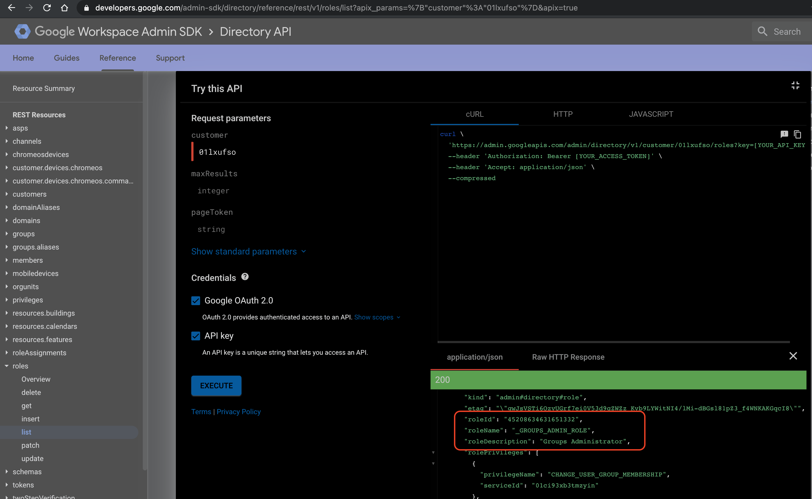
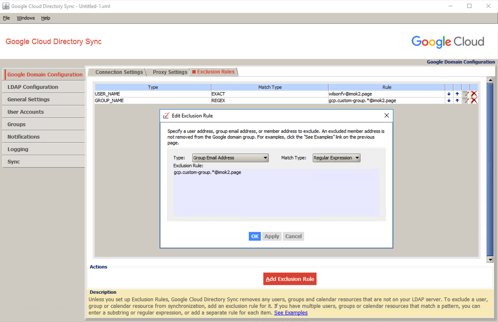

# GCDS and GCP Organization Custom Google Group Analysis
## Table of Contents
[Introduction](#introduction)<br/>
[Setup GCDS](#setup-gcds)<br/>
[Google Domain Customer ID](#google-domain-customer-id)<br/>
[IAM Roles to Manipulate Google Groups](#iam-roles-to-manipulate-google-groups)<br/>
[Terraform Modules](#terraform-modules)<br/>
[Test Scenario Terraform Deployment](#test-scenario-terraform-deployment)<br/>
[Test Scenario GCDS Sync](#test-scenario-gcds-sync)<br/>
[Summary](#summary)<br/>

## Introduction
This is to analyze during a Google Cloud Directory Sync ([GCDS](https://support.google.com/a/answer/106368)) 
from on-prem Active Directory (LDAP Server) to Google Domain, 
what would happen to user-managed google groups in Google Domain.

## Setup GCDS
This [create_windows_vm.sh](create_windows_vm.sh) will create a Windows GCE VM with external ip. <br/>
Once the Windows VM is created, use any RDP tool to login Windows VM, manually run the powershell script [win_startup.ps1](win_startup.ps1) on the VM, it will install GCDS and Chrome. <br/>
<br/>

On GCDS Configuration Manager, authenticate to Google Domain, such as<br/>

<br/>

connect to this public [LDAP testing server](https://www.forumsys.com/tutorials/integration-how-to/ldap/online-ldap-test-server/), such as<br/>

<br/>

only sync User Accounts and Groups from LDAP server, such as 

<br/>

add a search rule to search LDAP user accounts<br/>
```
(objectClass=*)
```

<br/>

add a search rule to search LDAP groups<br/>
```
(objectClass=groupOfUniqueNames)
```

<br/>

once above steps are done, we should be able to run "Simulate sync"<br/>


## Google Domain Customer ID
Google Domain Customer ID is essential for rest of the steps. It can be found from https://admin.google.com/ac/accountsettings <br/>


## IAM Roles to Manipulate Google Groups
According to [the doc](https://cloud.google.com/identity/docs/how-to/setup#assigning_an_admin_role_to_the_service_account), we can assign Group Admin role to a gcp user-defined service account in order to manipulate Google Groups.
> First, you should assign the Google Workspace Group Administrator Role (Group Administrator) to the service account you want to delegate to, using the Admin SDK Roles and Role Assignments API. This step gives the service account access to the groups of the domain but no other resource.

We will need to find out what's the role id for Group Administrator Role<br/>
Go to https://developers.google.com/admin-sdk/directory/reference/rest/v1/roles/list <br/>
Enter Customer ID and locate the roleId for Group Administrator <br/>

<br/>

According to [the doc](https://cloud.google.com/identity/docs/how-to/setup#auth-no-dwd), locate the unique ID for gcp user-defined service account <br/>
> 1. From the developer console, select IAM & Admin > Service Accounts and click on the service account you want to use with the Groups API.
> 2. Copy the Unique ID of the service account.

Go to https://developers.google.com/admin-sdk/directory/reference/rest/v1/roleAssignments/insert <br/>
Assign Group Administrator Role to gcp user-defined service account <br/>


## Terraform Modules
### Group Module
This [terraform group module](terraform_deployment_custom_group/main.tf) will manage user-defined Google Groups.<br/>
The module uses terraform resource [google_cloud_identity_group](https://registry.terraform.io/providers/hashicorp/google/latest/docs/resources/cloud_identity_group) <br/>
The module will accept input parameter json like this 
```json
{
  "custom_groups": {
    "image": {
      "display_name": "gcp.custom-group.image",
      "group_key_id": "gcp.custom-group.image@imok2.page"
    },
    "vpc1": {
      "display_name": "gcp.custom-group.vpc1",
      "group_key_id": "gcp.custom-group.vpc1@imok2.page"
    },
    "vpc2": {
      "display_name": "gcp.custom-group.vpc2",
      "group_key_id": "gcp.custom-group.vpc2@imok2.page"
    }
  }
}
```
It will create the groups, check [deploy_custom_group.log](deploy_custom_group.log) to see terraform output <br/>


### Group Membership Module
This [terraform group module](terraform_deployment_custom_group_membership/main.tf) will gcp user-defined service accounts to user-defined google groups.<br/>
The module uses terraform resource [google_cloud_identity_group_membership](https://registry.terraform.io/providers/hashicorp/google/latest/docs/resources/cloud_identity_group_membership) <br/>
The module will accept input parameter json like this 
```json
{
  "custom_groups_memberships": {
    "gcp.custom-group.image@imok2.page": [
        "image-sa1@gke-eu-1.iam.gserviceaccount.com",
        "image-sa2@gke-eu-1.iam.gserviceaccount.com"
    ],
    "gcp.custom-group.vpc1@imok2.page": [
        "vpc1-sa1@gke-eu-1.iam.gserviceaccount.com",
        "vpc1-sa2@gke-eu-1.iam.gserviceaccount.com"
    ],
    "gcp.custom-group.vpc2@imok2.page": [
        "vpc2-sa1@gke-eu-1.iam.gserviceaccount.com",
        "vpc2-sa2@gke-eu-1.iam.gserviceaccount.com"
    ]
  }
}
```

The module will first retrieve all existing Google Groups from the google domain using a data resource
```terraform
data "google_cloud_identity_groups" "all_groups" {
  provider = "google-beta"

  parent = local.parent_id
}
```

Then the module will loop-through each normalized membership, lookup the existing group id and add membership to the group id
```terraform
  for_each = local.memberships

  group = lookup({
    for obj in data.google_cloud_identity_groups.all_groups.groups:
      obj.group_key[0].id => obj.name
  }, each.value.group, "")
```

check [deploy_custom_group.log](deploy_custom_group.log) to see terraform output <br/>


## Test Scenario Terraform Deployment

### Test Scenario 1: GCP SA not in Group, GCP SA fail to access share image
Custom groups have been deployed, we have created a custom image in share project, the use-defined GCP SA will try to create a VM using the custom image from share project.
We will expect to see permission defined error (check [deploy_custom_group.log](deploy_custom_group.log))

```text
2021-04-01 20:43:41 CST    using impersonate service account to run as packer@gke-eu-1.iam.gserviceaccount.com, create a VM in service project using custom image from share project

2021-04-01 20:43:41 CST    we will expect to see permission denied Required 'compute.images.useReadOnly' error
WARNING: This command is using service account impersonation. All API calls will be executed as [packer@gke-eu-1.iam.gserviceaccount.com].
WARNING: This command is using service account impersonation. All API calls will be executed as [packer@gke-eu-1.iam.gserviceaccount.com].
ERROR: (gcloud.compute.instances.create) Could not fetch resource:
 - Required 'compute.images.useReadOnly' permission for 'projects/vpchost-eu-dev/global/images/custom-image'
```

### Test Scenario 2: After GCP SA added into the Group, GCP SA can create VM using share image
Add the GCP user-defined SA into the custom group using terraform module and grant roles/compute.imageUser to the custom group, GCP SA can create VM using share image (check [deploy_custom_group.log](deploy_custom_group.log))

```text
google_cloud_identity_group_membership.custom_group_membership["gcp.custom-group.image@imok2.page_packer@gke-eu-1.iam.gserviceaccount.com"]: Creating...
google_cloud_identity_group_membership.custom_group_membership["gcp.custom-group.vpc1@imok2.page_packer@gke-eu-1.iam.gserviceaccount.com"]: Creating...
google_cloud_identity_group_membership.custom_group_membership["gcp.custom-group.image@imok2.page_packer@gke-eu-1.iam.gserviceaccount.com"]: Creation complete after 7s [id=groups/0279ka653q8et2x/memberships/107779781112863132850]
google_cloud_identity_group_membership.custom_group_membership["gcp.custom-group.vpc1@imok2.page_packer@gke-eu-1.iam.gserviceaccount.com"]: Creation complete after 9s [id=groups/048pi1tg4afd1ml/memberships/107779781112863132850]

Apply complete! Resources: 2 added, 0 changed, 0 destroyed.

The state of your infrastructure has been saved to the path
below. This state is required to modify and destroy your
infrastructure, so keep it safe. To inspect the complete state
use the `terraform show` command.

State path: ./terraform_deployment_custom_group_membership/terraform_state

Outputs:

custom_groups_memberships = {
  "gcp.custom-group.image@imok2.page_packer@gke-eu-1.iam.gserviceaccount.com" = {
    "create_time" = "2021-04-01T12:44:23.974776Z"
    "group" = "groups/0279ka653q8et2x"
    "id" = "groups/0279ka653q8et2x/memberships/107779781112863132850"
    "member_key" = [
      {
        "id" = "packer@gke-eu-1.iam.gserviceaccount.com"
        "namespace" = ""
      },
    ]
    "name" = "groups/0279ka653q8et2x/memberships/107779781112863132850"
    "preferred_member_key" = [
      {
        "id" = "packer@gke-eu-1.iam.gserviceaccount.com"
        "namespace" = ""
      },
    ]
    "roles" = [
      {
        "name" = "MEMBER"
      },
    ]
    "type" = "SERVICE_ACCOUNT"
    "update_time" = "2021-04-01T12:44:23.974776Z"
  }
```
```text
2021-04-01 20:44:37 CST    after roles/compute.imageUser granted to the custom group, service project SA is now able to use custom image to create VM
WARNING: This command is using service account impersonation. All API calls will be executed as [packer@gke-eu-1.iam.gserviceaccount.com].
WARNING: This command is using service account impersonation. All API calls will be executed as [packer@gke-eu-1.iam.gserviceaccount.com].
Created [https://www.googleapis.com/compute/v1/projects/gke-eu-1/zones/europe-west1-b/instances/temp-vm].
WARNING: Some requests generated warnings:
 - Disk size: '200 GB' is larger than image size: '10 GB'. You might need to resize the root repartition manually if the operating system does not support automatic resizing. See https://cloud.google.com/compute/docs/disks/add-persistent-disk#resize_pd for details.

NAME     ZONE            MACHINE_TYPE  PREEMPTIBLE  INTERNAL_IP  EXTERNAL_IP     STATUS
temp-vm  europe-west1-b  f1-micro      true         10.132.0.11  104.155.91.139  RUNNING
```

### Test Scenario 3: Remove GCP SA from the group, GCP SA will fail to create VM using share image
Remove the GCP user-defined SA from the custom group, GCP SA will fail to create VM using share image due to permission error 
(check [deploy_custom_group.log](deploy_custom_group.log))

```text
google_cloud_identity_group_membership.custom_group_membership["gcp.custom-group.vpc1@imok2.page_packer@gke-eu-1.iam.gserviceaccount.com"]: Destroying... [id=groups/048pi1tg4afd1ml/memberships/107779781112863132850]
google_cloud_identity_group_membership.custom_group_membership["gcp.custom-group.image@imok2.page_packer@gke-eu-1.iam.gserviceaccount.com"]: Destroying... [id=groups/0279ka653q8et2x/memberships/107779781112863132850]
google_cloud_identity_group_membership.custom_group_membership["gcp.custom-group.vpc1@imok2.page_packer@gke-eu-1.iam.gserviceaccount.com"]: Destruction complete after 2s
google_cloud_identity_group_membership.custom_group_membership["gcp.custom-group.image@imok2.page_packer@gke-eu-1.iam.gserviceaccount.com"]: Destruction complete after 2s
```
```text
2021-04-01 20:46:29 CST    wait 120 seconds for gcp to propagate the state that packer@gke-eu-1.iam.gserviceaccount.com has removed from the custom group and lost permission to the share image

2021-04-01 20:48:29 CST    authenticate as service project service account
Activated service account credentials for: [terraform@gke-eu-1.iam.gserviceaccount.com]

2021-04-01 20:48:31 CST    using impersonate service account to run as packer@gke-eu-1.iam.gserviceaccount.com, create a VM in service project using custom image from share project

2021-04-01 20:48:31 CST    since packer@gke-eu-1.iam.gserviceaccount.com has been removed from custom groups, we will expect to see permission denied Required 'compute.images.useReadOnly' error
WARNING: This command is using service account impersonation. All API calls will be executed as [packer@gke-eu-1.iam.gserviceaccount.com].
WARNING: This command is using service account impersonation. All API calls will be executed as [packer@gke-eu-1.iam.gserviceaccount.com].
ERROR: (gcloud.compute.instances.create) Could not fetch resource:
 - Required 'compute.images.useReadOnly' permission for 'projects/vpchost-eu-dev/global/images/custom-image'
```

## Test Scenario GCDS Sync
### Test Scenario 1: Add a group exclusion rule, run simulate sync
On GCDS Configuration Manager, add a group exclusion rule in google domain configuration <br/>


Run Simulate sync button, from [gcds_sync_with_group_exclusion_rule.log](gcds_simulate_sync_logs/gcds_sync_with_group_exclusion_rule.log) and below screenshot, 
we can see GCDS has used the exclusion rule to exclude remote Google Groups

```text
[2021-04-01 13:19:01,531+0000] [SwingWorker-pool-2-thread-9] [INFO] [sync.agent.FullSyncAgent] Successfully retrieved information from all sources.
[2021-04-01 13:19:01,547+0000] [SwingWorker-pool-2-thread-9] [INFO] [sync.agent.FullSyncAgent] Retrieved 0 users from remote sources, and 15 users from local sources.
[2021-04-01 13:19:01,547+0000] [SwingWorker-pool-2-thread-9] [INFO] [sync.agent.FullSyncAgent] Retrieved 0 groups from remote sources, and 3 groups from local sources.
[2021-04-01 13:19:01,547+0000] [SwingWorker-pool-2-thread-9] [INFO] [sync.agent.FullSyncAgent] Analyzing differences and computing changes.
```


### Test Scenario 2: Without group exclusion rule, run simulate sync
On GCDS Configuration Manager, remove the group exclusion rule in google domain configuration then run Simulate sync button<br/>

From [gcds_sync_without_group_exclusion_rule.log](gcds_simulate_sync_logs/gcds_sync_without_group_exclusion_rule.log) and below screenshot, 
we can see that without group exclusion rule, GCDS can retrieve remote Google Groups, however GCDS will skip the remote Google Groups from sync 
since these remote Google Groups are user-created

```text
[2021-04-01 13:25:32,687+0000] [SwingWorker-pool-2-thread-1] [INFO] [sync.agent.FullSyncAgent] Retrieved 0 users from remote sources, and 15 users from local sources.
[2021-04-01 13:25:32,687+0000] [SwingWorker-pool-2-thread-1] [INFO] [sync.agent.FullSyncAgent] Retrieved 3 groups from remote sources, and 3 groups from local sources.
[2021-04-01 13:25:32,687+0000] [SwingWorker-pool-2-thread-1] [INFO] [sync.agent.FullSyncAgent] Analyzing differences and computing changes.
[2021-04-01 13:25:32,718+0000] [SwingWorker-pool-2-thread-1] [INFO] [diff.engine.CompleteDiffEngine] Not removing group gcp.custom-group.image@imok2.page as it is user-created.
[2021-04-01 13:25:32,718+0000] [SwingWorker-pool-2-thread-1] [INFO] [diff.engine.CompleteDiffEngine] Not removing group gcp.custom-group.vpc1@imok2.page as it is user-created.
[2021-04-01 13:25:32,718+0000] [SwingWorker-pool-2-thread-1] [INFO] [diff.engine.CompleteDiffEngine] Not removing group gcp.custom-group.vpc2@imok2.page as it is user-created.
```


# Summary 
(to be added...)